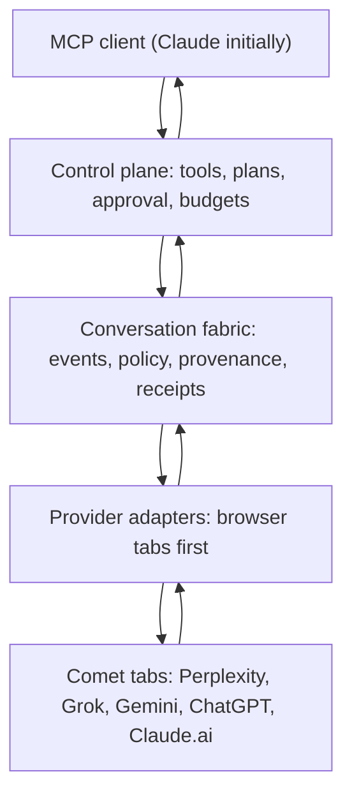

# Comet-MCP Multi-Provider Conversation Backbone

## Executive synthesis

Build Comet-MCP as a provider-neutral conversation fabric with browser-tab automation as its first transport—not as a Perplexity driver enlarged to five websites.

The prior Sonnet, GPT-5.6, and Grok 4.5 outlines agree on the essential foundation:

- Replace single-provider, single-session logic with a provider registry and common driver contract.
- Maintain several independently controlled Comet tabs through concurrent CDP sessions.
- Use offline/on-demand discovery to obtain and refresh provider selectors.
- Treat selector drift, login expiry, streaming state, and browser UI differences as normal operational states.
- Add relaying, shared conversation state, and bounded orchestration only after the tab layer is reliable.

Grok’s contribution is especially valuable: measurable phase gates, a concurrency spike before architecture commitment, markdown fidelity as a gate, health reporting, persistent overrides, and an explicit scope boundary. GPT-5.6 correctly makes the contract, CDP typing strategy, conversation log, and `wait_any` concrete. Sonnet correctly identifies the main architectural shift: tabs become independent provider sessions; the cross-provider conversation exists outside any one provider’s chat history.

The revised design keeps all of that, with one correction:

> The primary abstraction is a conversation event and delivery receipt, not a raw message copied from one tab into another.

This ensures relay, recovery, scheduling, provenance, and future API-based providers work without becoming coupled to Comet’s browser UI.

## Scope

### Goal

Allow an MCP client—initially Claude—to coordinate Perplexity, Grok, Gemini, ChatGPT, and Claude.ai concurrently, each in its own Comet tab, and optionally relay selected messages between them.

### v1 non-goals

- Multiple Comet processes or browser profiles.
- Multi-account isolation.
- Fully autonomous provider-to-provider conversations by default.
- A visual selector-picker interface.
- Replacing Comet with a generic browser automation platform.
- Guaranteed compatibility with every provider UI or plan tier.

### Safety and operating posture

Browser UI automation, especially automated relay between commercial AI chat sites, can encounter terms restrictions, rate limits, CAPTCHA challenges, UI changes, and prompt-injection defenses. The server must:

- Default cross-provider relays to approval-required.
- Enforce bounded time, turns, and content size.
- Preserve provenance for every relayed message.
- Fail one provider independently rather than failing the session.
- Never silently retry a conversational send after uncertain delivery.

## Architecture



### 1. Control plane

The MCP-facing layer exposes tools, scheduling, budgets, cancellation, and client-visible health. It must not assume Claude is the only possible client.

| Tool | Purpose |
|---|---|
| `provider_open` | Open or attach a provider tab |
| `provider_list` | List tabs, provider, state, and current activity |
| `provider_ask` | Queue/send a client-originated prompt |
| `provider_poll` | Get current state and completed response |
| `provider_stop` | Stop generation in one tab |
| `provider_close` | Close a tab subject to last-tab protection |
| `provider_health` | Show login and hook-resolution health |
| `provider_override` | Persist a selector override |
| `relay_prepare` | Construct a policy-reviewed relay envelope |
| `relay_send` | Send an approved relay |
| `wait_any` | Wait for one of several tabs to complete or degrade |
| `run_plan` / `step_plan` | Register and advance bounded plans |
| `provider_evaluate` | Optional gated diagnostic tool; never a normal orchestration primitive |

Keep existing `comet_*` tools as deprecated aliases for one release if existing Claude configurations use them.

### 2. Conversation fabric

The fabric owns the durable cross-provider thread. Individual provider tabs retain only their local conversation history.

```ts
type DeliveryState =
  | "queued"
  | "sent"
  | "accepted"
  | "completed"
  | "blocked"
  | "timed_out"
  | "unknown";

interface ConversationEnvelope {
  id: string;
  conversationId: string;
  parentEventId?: string;
  createdAt: string;
  source: { actor: "client" | "provider" | "system"; providerKey?: string; tabId?: string };
  destination: { providerKey: string; tabId?: string };
  content: { format: "text" | "markdown"; body: string };
  provenance: { kind: "user" | "provider_output" | "summary"; trusted: false; sourceEventId?: string };
  relay: { requested: boolean; mode: "verbatim" | "wrapped" | "summarize"; approvedBy?: "client" | "policy" };
  budget: { maxChars: number; deadlineAt: string };
}

interface DeliveryReceipt {
  envelopeId: string;
  tabId: string;
  state: DeliveryState;
  observedAt: string;
  providerMessageId?: string;
  detail?: string;
}
```

A response extraction is also an event. Do not rely only on `lastExtractHash`; preserve the provider-native message ID where available, a content hash, a version/cursor, and the associated envelope ID. This prevents duplicate logs after reconnects and avoids ambiguous retries.

### 3. Provider adapter layer

Each provider is described by a registry entry and driven by common methods. Configuration should cover most provider variation, but the contract must permit narrowly scoped driver overrides.

```ts
type FoundVia = "override" | "known" | "heuristic" | "missing";

interface ProviderOperation {
  available: boolean;
  foundVia: FoundVia;
  confidence: "high" | "medium" | "low";
  lastVerifiedAt?: string;
}

interface ProviderEntry {
  schemaVersion: number;
  key: "perplexity" | "grok" | "gemini" | "chatgpt" | "claude";
  name: string;
  home: string;
  freshChatByNavigation: boolean;
  hooks: { composer: ProviderHook; send: ProviderHook; stop: ProviderHook; response: ProviderHook; newChat?: ProviderHook; model?: ProviderHook };
  operations: { send: ProviderOperation; stop: ProviderOperation; extract: ProviderOperation; reset: ProviderOperation; regenerate?: ProviderOperation; editLast?: ProviderOperation };
  status: { workingSignal: "stop-visible"; completedSignal: "stop-gone + new-assistant-content" };
  typing: "insertText" | "keyEvents";
  markdown: "innerText" | "turndown";
  relayPolicy: RelayPolicy;
}

interface ProviderHook { known: string[]; heuristic: string; override?: string }

interface RelayPolicy {
  enabled: boolean;
  defaultMode: "wrapped" | "summarize";
  maxRelayChars: number;
  rawRelayMaxChars: number;
  requireClientApproval: boolean;
  forceAttributionHeader: boolean;
}
```

Key runtime rules:

- One held CDP session per tab, managed through a session pool.
- Never cache a stop button or other dynamic DOM node across polls.
- Re-resolve working state every poll; `stop-visible` is the primary active-generation signal.
- Use CDP text insertion and real Enter key events for ProseMirror-like editors; do not depend on fragile `execCommand` behavior.
- Treat `login_required`, `degraded`, and `unknown_delivery` as first-class states.
- Persist selector overrides and provider health observations locally.
- Do not treat capability discovery from DOM presence as confirmation of reliable behavior.

## Persistence and observability

```text
comet-mcp/
  src/
    types/
      conversation.ts
      chat-driver.ts
      provider.ts
    core/
      conversation-fabric.ts
      delivery-manager.ts
      tab-registry.ts
      cdp-session-pool.ts
      provider-loader.ts
      relay-policy.ts
      scheduler.ts
      health-log.ts
    providers/
      perplexity.ts
      grok.ts
      gemini.ts
      chatgpt.ts
      claude.ts
    tools/
      provider-tools.ts
      relay-tools.ts
      plan-tools.ts
    test/
      fixtures/
      unit/
      integration/
  docs/
    accepted-risks.md
    p0-cdp-concurrency-findings.md

  ~/.comet-mcp/
    overrides.json
    session.json
    health-log.jsonl
```

Persist only what is required for recovery. Support content redaction or no-content logging because cross-provider logs can contain sensitive material.

## Discovery and repair workflow

Use chrome-agent or equivalent inspection tooling as an offline/on-demand selector miner, not in the hot path.

For each provider:

1. Connect to an already authenticated Comet/browser profile.
2. Inspect idle controls: composer, send button, model picker, new chat, and visible response containers.
3. Test the actual submission path.
4. Capture idle, typing, streaming, stopped, and completed states.
5. Send a harmless validation prompt such as `Say only: PONG`.
6. Produce a provider entry with known selectors and constrained heuristics.
7. Store verification time, discovery method, and confidence.
8. Add synthetic DOM fixtures for each state.
9. Re-run discovery and diff the provider entry after sustained heuristic or missing-hook health reports.

`repair_provider(tabId)` is limited to hook re-resolution, a scoped tab reset, and a validation probe. It must not replay a user or relayed message automatically.

## Phases and task list

### P0 — Architecture and empirical feasibility

**Outcome:** approved boundaries and a measured CDP concurrency ceiling.

- [ ] Write an architecture decision record defining browser-tab transport, non-goals, privacy posture, and approval-required relay default.
- [ ] Run a CDP spike against the actual Comet debug endpoint.
- [ ] Open 2, then 3, then 5 tabs; maintain one CDP connection per target.
- [ ] Run concurrent `Runtime.evaluate` and text-input exercises for 60 seconds.
- [ ] Record latency, errors, disconnects, cross-tab effects, CAPTCHA/anomaly behavior, and the maximum stable tab count.
- [ ] Publish `docs/p0-cdp-concurrency-findings.md`.
- [ ] Decide the default concurrent-tab cap from measured evidence.

**Gate:** five sessions, or the measured lower safe limit, operate without silent loss of control or cross-tab interference.

### P1 — Conversation fabric and Perplexity compatibility

**Outcome:** durable commands and events under existing single-provider behavior.

- [x] Implement `ConversationEnvelope`, event log, delivery receipts, correlation IDs, and idempotency keys. (types: `src/types/conversation.ts`, ADR 0002 — runtime store still to build)
- [x] Define `ChatDriver`, `ProviderEntry`, `TabSession`, `HealthReport`, and `PollResult`. (types: `src/types/provider.ts`, entries: `src/providers/{grok,perplexity}.ts`, ADR 0002)
- [ ] Refactor Perplexity behavior into the provider contract without changing user-visible behavior.
- [ ] Preserve and test existing extraction fixes: ordering, truncation, whitespace, escaping, and steps parsing.
- [ ] Add synthetic fixtures for idle, typing, streaming, complete, login-required, and degraded states.
- [ ] Add a migration path from `comet_*` to `provider_*`.
- [ ] Implement conservative Perplexity defaults: relay disabled or approval-required.

**Gate:** ten representative prompts retain existing ask/poll/stop behavior; recovery/replay creates no duplicate send.

### P2 — First heterogeneous adapter: Grok

**Outcome:** discovery-to-runtime pipeline proven against a materially different UI.

- [ ] Run the discovery workflow against Grok.
- [ ] Implement composer, send, stop, response extraction, reset, and health handling.
- [ ] Use correct CDP insertion/key behavior for Grok’s editor.
- [ ] Decide and test markdown extraction strategy.
- [ ] Add fixture-driven tests and live `PONG` validation.
- [ ] Record operation confidence and capability evidence.

**Gate:** Grok supports successful ask, poll, stop, extraction, reset, and health reporting with known or explicitly documented heuristic hooks.

### P3 — Multi-tab control plane

**Outcome:** independent provider sessions operating concurrently.

- [ ] Implement `Map<tabId, TabSession>` registry.
- [ ] Implement CDP session pool keyed by tab.
- [ ] Replace global close-all/new-chat behavior with scoped tab reset.
- [ ] Implement last-tab protection per provider.
- [ ] Add `provider_open`, `provider_list`, `provider_close`, `provider_health`, and `provider_override`.
- [ ] Persist overrides.
- [ ] Add `lastKnownMessageId`, extraction cursor/version, content hash, and `lastCompletedAt`.
- [ ] Implement reconnect logic that does not produce duplicate response events.

**Gate:** Perplexity and Grok can be opened, asked, polled, reset, and closed independently; closing or degrading one does not affect the other.

### P4 — Safe relay and shared conversation state

**Outcome:** controlled cross-provider communication with provenance and receipts.

- [ ] Implement `relay_prepare` to select the source event and build an envelope.
- [ ] Enforce relay policy before transmission: approval, attribution, length, markdown treatment, timeout, and provider enablement.
- [ ] Implement wrapped relay with an explicit provenance header.
- [ ] Implement local summarization handoff as a client-controlled action, not an implicit claim that the server is Claude.
- [ ] Implement `relay_send` and record a receipt for every attempt.
- [ ] Add content-size and structure limits before provider input.
- [ ] Add conversation-log persistence and redaction configuration.
- [ ] Test blocked, timed-out, and uncertain deliveries without automatic resend.

**Gate:** a selected Perplexity or Grok answer can be relayed to the other only after approval, with a complete event trail and safe failure behavior.

### P5 — Bounded scheduling and efficient waiting

**Outcome:** clients can coordinate long-running tasks without noisy polling or runaway loops.

- [ ] Implement `wait_any(tabIds, timeoutMs)`.
- [ ] Implement `run_plan` and `step_plan`.
- [ ] Require each plan to declare maximum turns, wall-clock deadline, content/relay-byte limit, and failure policy.
- [ ] Support cancellation and resumable halted plans.
- [ ] Do not ship unbounded `round_robin`.
- [ ] Return normalized response bundles for client-side ranking.

**Gate:** a three-step plan halts cleanly on budget exhaustion, leaves no tab incorrectly marked working, and resumes without duplicate sends.

### P6 — Expand adapter coverage

**Outcome:** Gemini, ChatGPT, and Claude.ai join through the same adapter process.

- [ ] Repeat discovery, fixture, health, and `PONG` validation for each provider.
- [ ] Add provider-specific markdown and typing settings.
- [ ] Simulate missing hooks and login expiry for each adapter.
- [ ] Keep provider-specific code minimal; add driver overrides only when configuration cannot express the behavior.
- [ ] Validate per-provider relay policy before enabling relay.

**Gate:** all five providers report structured health and degrade independently; a missing selector never becomes a silent empty response.

### P7 — Optional conversation patterns

**Outcome:** higher-level orchestration built on receipts and policies, not direct DOM coupling.

- [ ] `broadcast(prompt, providerKeys)` returns a normalized response bundle.
- [ ] `critique(sourceEventId, reviewer)` creates an approval-traceable relay.
- [ ] `fanout_and_rank` delegates ranking to the MCP client or an explicitly selected evaluator provider.
- [ ] `specialist_route` matches required operations, risk policy, health, and availability; returns `null` rather than guessing.
- [ ] `debate` creates a bounded, isolated conversation slice with explicit judge and budget.
- [ ] `repair_provider` remains one-shot and message-safe.

**Gate:** no P7 pattern can exceed its declared budget, leak unrelated conversation history, or bypass relay approval.

### P8 — Operational hardening

**Outcome:** the backbone is maintainable over time.

- [ ] Append structured health observations to `health-log.jsonl`.
- [ ] Surface hook failure rate, last degraded time, and last successful verification.
- [ ] Document selector maintenance, concurrency ceiling, retention, relay exposure, login expiry, UI automation risks, and deprecation timeline.
- [ ] Add regression fixtures whenever a provider UI changes.
- [ ] Establish a release checklist requiring provider health and relay-policy review.

**Gate:** the system can explain why a provider is unavailable, which selector path was used, whether a relay was delivered, and what action is safe next.

## Test matrix

| Test | Phase | Pass condition |
|---|---|---|
| Concurrent CDP load | P0 | Measured stable tab limit with no silent disconnects |
| Perplexity compatibility | P1 | Ask/poll/stop behavior unchanged across fixture and live prompts |
| Replay safety | P1 | Restart/retry does not duplicate a send |
| Grok end-to-end probe | P2 | `PONG` extracted with structured health report |
| Independent tab operation | P3 | Two providers have no cross-talk; one can degrade independently |
| Reconnect deduplication | P3 | Unchanged content produces no new response event |
| Relay policy enforcement | P4 | Unapproved or oversized relay is blocked before provider input |
| Delivery uncertainty | P4 | Unknown send outcome is surfaced, never silently retried |
| Bounded plan halt | P5 | Deadline/turn budget halts exactly and preserves state |
| `wait_any` | P5 | Returns the first completed/degraded tab accurately |
| Provider degradation | P6 | Missing hook and login expiry report structured state |
| Debate isolation | P7 | Judge sees only the tagged debate slice and obeys budget |

## Ship boundary

The minimum useful release is P0 through P5 with two providers: Perplexity and Grok.

It demonstrates the actual product thesis:

1. Claude opens two independent provider tabs.
2. Claude asks both the same question.
3. Comet-MCP returns normalized responses and delivery state.
4. Claude selects one response for a provenance-preserving, approval-required relay.
5. The server records the cross-provider exchange durably.
6. A restart, selector failure, or stalled provider does not duplicate work or collapse the other conversation.

Gemini, ChatGPT, Claude.ai, automatic routing, ranking, and debates are valuable expansions, but they should not delay proving that narrow vertical slice.

